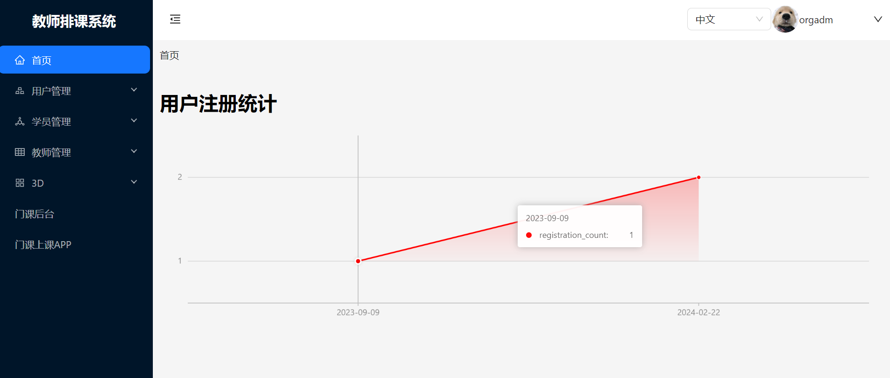
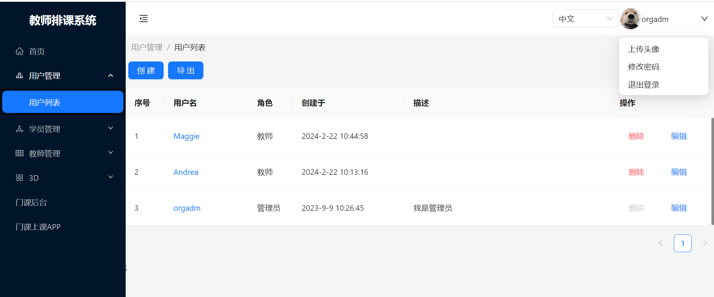
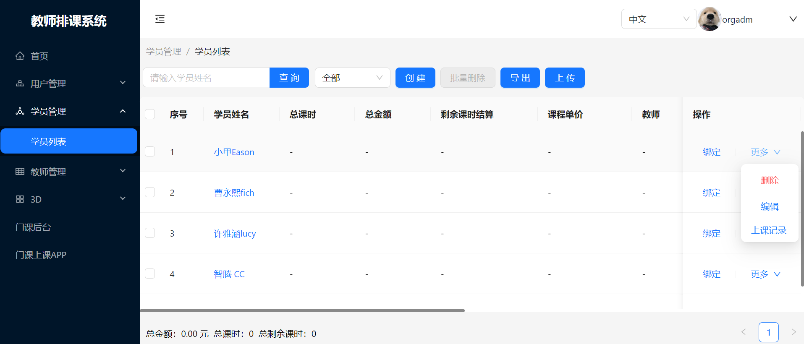
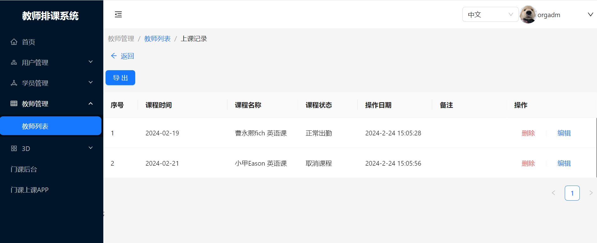
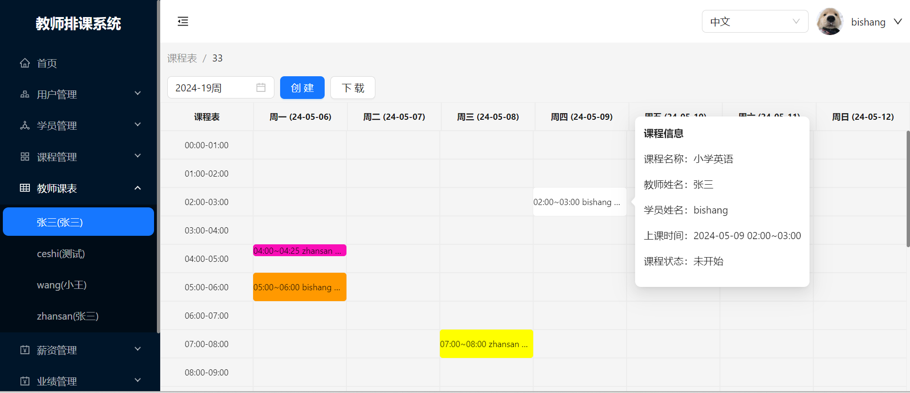

# react-vite-ts

此项目是 react + vite + ts+antd 构建的后台管理系统，是后台项目[nest-server](https://github.com/shang1003/nest-server) 的管理系统，所有的数据都是从服务器获取的真实数据，具有真实的注册、登陆、管理数据、权限验证等功能。

## 安装

```sh
npm install
```

### 运行

```sh
npm run dev
```

### 编译

```sh
npm run build
```

### 登录页面


### 首页



### 用户管理



### 学生管理



### 课程管理



### 教师课表


