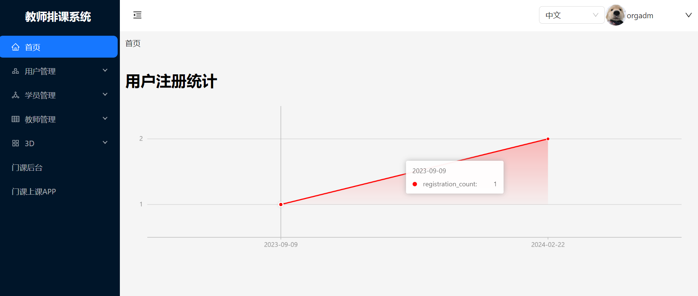
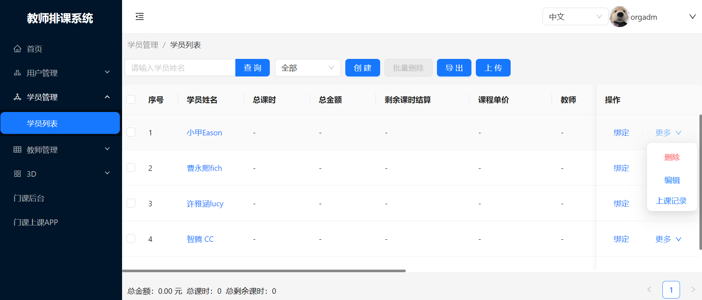
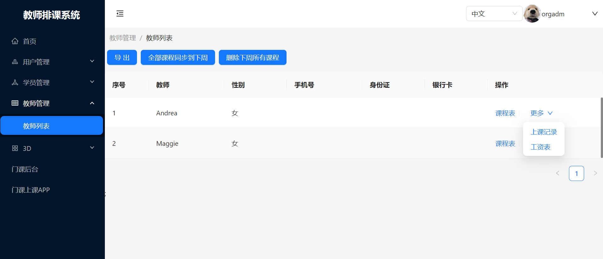
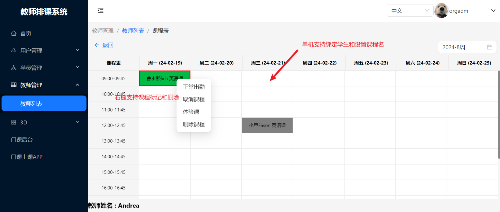
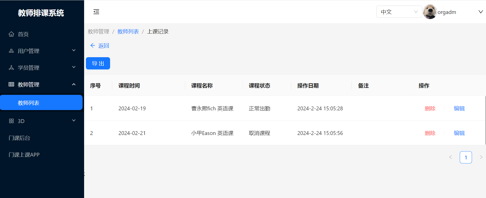
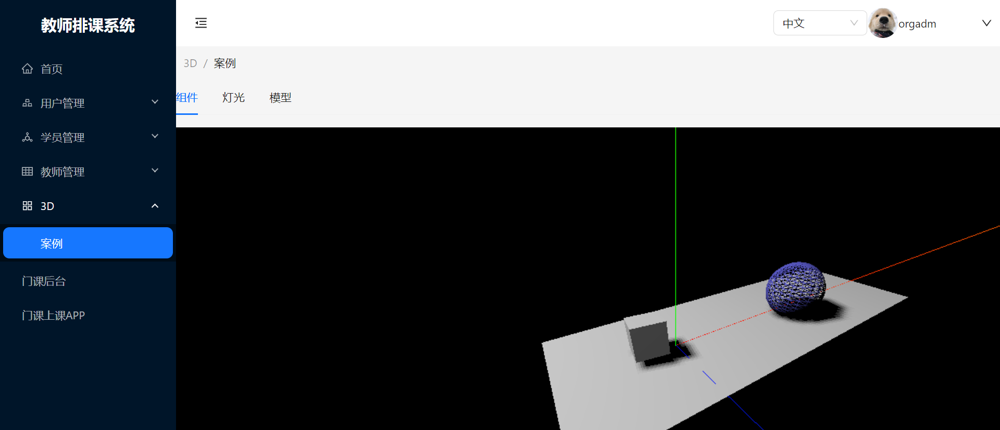

# react-vite-ts

教师排课系统 框架：react、typescript 、react-router v6 / react+vite、bizchart、threejs等，本系统支持动态表单，中英文切换，可视化图表等。封装 请求、table,表单、删除等。该系统方便管理员添加教师，给教师排课，录入学员信息等。模块有，用户管理，学员管理,，教师管理（课表，上课记录，工资表）。用户名 orgadm 密码1234。

## 安装

```sh
npm install
```

### 运行

```sh
npm run dev
```

### 编译

```sh
npm run build
```

### 登录页面

### 首页

### 用户管理

### 学生管理

### 教师管理

### 教师课表

### 上课记录

### 3D

